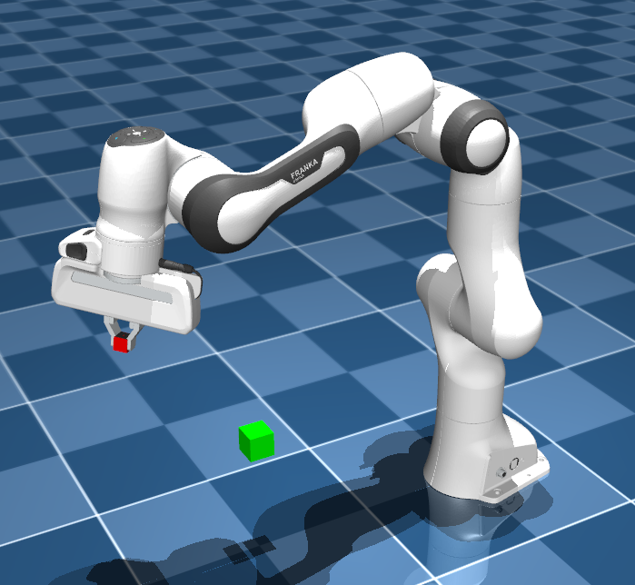
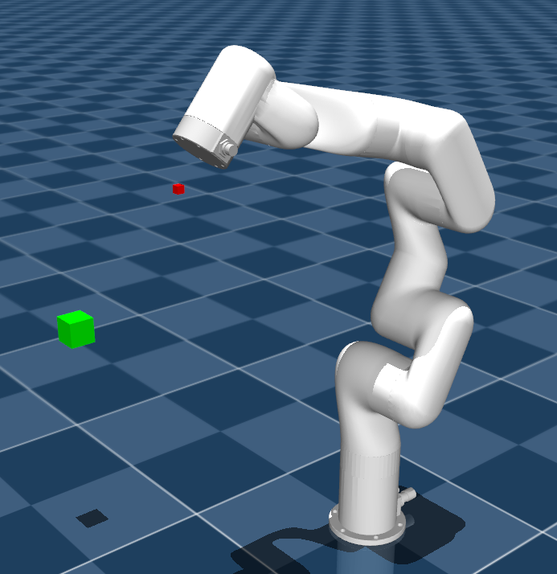

# Arm Robots controlling by Reinforcement Learning

This project is part of a 4-month international internship at Professor Yoshida's laboratory at the Tokyo University of Science in Katsushika, supervised by Dr. Marwan Hamze.

The objective of this project is to contribute to research on the use of machine learning to control robots, specifically humanoid robots. The advantage of using reinforcement learning for robot control is that it frees us from relying on the kinematic and mathematical models of the robot, which can be very difficult or even impossible to compute.
The project involves developing a model to control the Xarm6 robot using AI, both in simulation and in the real world. 

To achieve this objective, I was inspired by the work of Zichun Xu, Yuntao Li, Xiaohang Yang, Zhiyuan Zhao, Lei Zhuang, and Jingdong Zhao, entitled Open-Source Reinforcement Learning Environments Implemented in MuJoCo with Franka Manipulator, which deals with RL control of the Franka Emika Panda robot arm. In their study, they used AI to predict the next position of the robot's end effector in order to achieve the goal. However, this technique requires access to the robot's inverse kinematics to control the arm by the position of its end effector. My work focused on minimizing the use of inverse kinematics by adapting their approach to control the arm through the angular positions of its actuators.

After accomplishing this, my next step was to adapt my algorithm to the Xarm6 arm to conduct real-world tests in the Joint Robotics Laboratory at the Tokyo University of Science.

In this Git repository, you can find both my work on the Franka Emika Panda robot and the Xarm6 arm.

## Requirements

The following essential libraries, along with their corresponding versions, are required:

    mujoco==2.3.3
    gymnasium==0.29.1
    gymnasium-robotics==1.2.2
    stable-baselines3==2.2.1

## Robot Arm

`FrankaEmikaPanda` | `Xarm6` |
|:------------------------:|:------------------------:|
 |  |

